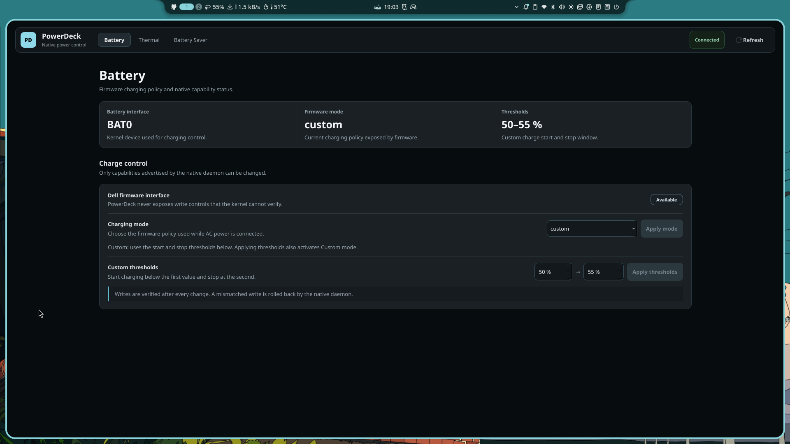

# PowerDeck

Native Dell laptop power management for Linux, developed on CachyOS/Niri.

PowerDeck 2.x is a native application stack: Rust owns the privileged power
logic, telemetry, user agent and CLI; C++20/Qt6 Widgets owns the GUI; a tiny C
helper is used only for the `perf_event_open(2)` ABI boundary.

There is no Python runtime or Python source tree in the current native branch.



## Current status

The native cutover is complete and the main runtime is:

- `powerdeckd`: privileged Rust system D-Bus service.
- `powerdeck-agent`: Rust user service for Battery Saver automation.
- `powerdeckctl`: Rust CLI.
- `powerdeck`: C++20 / Qt6 Widgets + QtDBus GUI.
- `powerdeck-telemetry`: Rust telemetry with a tiny C perf helper.

The current development target is a Dell Inspiron 15 3530 on CachyOS/Niri.
PowerDeck still capability-checks each control at runtime instead of assuming
that every Dell model exposes the same kernel interfaces.

## Features

### Battery charge control

PowerDeck reads Dell-compatible charging controls from Linux
`/sys/class/power_supply` and exposes only modes advertised by the kernel.

On the current target laptop the firmware exposes:

- **Express (Fast)** — prioritizes charging speed.
- **Standard** — normal charging policy.
- **Adaptive** — lets firmware adapt charging to the usage pattern.
- **Custom** — uses explicit start and stop thresholds.

Custom thresholds are validated before a write:

- start: 50–95%
- end: 55–100%
- minimum gap: 5 percentage points

Writes are read back after the change. A mismatched write is rolled back when
the previous state can be restored safely.

### Thermal profiles and telemetry

PowerDeck uses the kernel platform-profile interface for firmware cooling
profiles. The current target exposes:

- `cool`
- `quiet`
- `balanced`
- `performance`

The Thermal page also shows read-only native telemetry:

- CPU package power from Intel RAPL, with Linux perf fallback.
- GPU power from DRM hwmon, with Linux perf fallback.
- Fan RPM from Linux hwmon.

PowerDeck does **not** write raw fan PWM or force a specific RPM. Cooling
profiles remain firmware-managed.

### Battery Saver

The native user agent can apply a coordinated policy manually or when AC power
changes:

- brightness cap
- optional "only lower brightness" behavior
- internal-display refresh-rate target on Niri
- OS power profile
- firmware thermal profile
- Intel turbo disable
- Intel P-state maximum performance percentage
- keyboard backlight level
- optional default-output audio mute

Restore-on-AC is ownership-aware: PowerDeck restores only values that are still
owned by the Battery Saver session.

## Architecture

PowerDeck intentionally keeps privileged writes out of the GUI.

```text
C++20 / Qt6 Widgets GUI
          |
          | system + session D-Bus
          |
          +-----------------------------+
          |                             |
          v                             v
Rust user agent                 Rust privileged daemon
powerdeck-agent                 powerdeckd
          |                             |
          |                             +-- charge control
          |                             +-- thermal profile
          |                             +-- Intel P-state
          |                             +-- telemetry
          |                                  |
          |                                  +-- Rust samplers
          |                                  +-- tiny C perf helper
          |
          +-- brightness
          +-- refresh rate
          +-- OS power profile
          +-- keyboard backlight
          +-- audio mute
```

Stable D-Bus services:

```text
org.powerdeck.System1
org.powerdeck.Agent1
```

System writes use Polkit authorization. The current policy allows the active
local desktop session and denies inactive or non-local contexts. The daemon
still validates inputs and verifies hardware state after writes.

## Native quality gate

On Arch/CachyOS, install the build dependencies:

```fish
sudo pacman -S --needed \
    rust \
    cmake \
    ninja \
    qt6-base \
    gcc \
    pkgconf \
    polkit
```

Then run the complete native gate:

```fish
cd ~/Projects/PowerDeck
./native/scripts/native-check.sh
```

It checks:

- `cargo fmt`
- Clippy with warnings denied
- all Rust tests
- optimized Rust release build
- Qt6 CMake configure/build
- absence of Python source/package metadata

## Run from the source tree

Build first:

```fish
cd ~/Projects/PowerDeck
./native/scripts/build-release.sh
```

Run the GUI:

```fish
./powerdeck
```

Run the CLI:

```fish
./native/target/release/powerdeckctl-native status
```

Useful CLI commands:

```fish
./native/target/release/powerdeckctl-native status --json
./native/target/release/powerdeckctl-native telemetry --json
./native/target/release/powerdeckctl-native charge get --json
./native/target/release/powerdeckctl-native thermal get --json
./native/target/release/powerdeckctl-native cpu get --json
./native/target/release/powerdeckctl-native saver state --json
```

## Development install

After the full gate is green:

```fish
cd ~/Projects/PowerDeck
./native/scripts/dev-install.sh
```

Canonical installed paths include:

```text
/usr/bin/powerdeck
/usr/bin/powerdeckctl
/usr/lib/powerdeck/powerdeckd
/usr/lib/powerdeck/powerdeck-agent
```

Service integration includes systemd, D-Bus and Polkit files.

Runtime checks:

```fish
busctl call \
    org.powerdeck.System1 \
    /org/powerdeck/System1 \
    org.powerdeck.System1 \
    Ping

busctl --user call \
    org.powerdeck.Agent1 \
    /org/powerdeck/Agent1 \
    org.powerdeck.Agent1 \
    Ping
```

Both should return `pong`.

## Runtime and optional dependencies

Core runtime:

- Qt 6 Base
- systemd / D-Bus
- Polkit

Optional feature tools:

- `brightnessctl` — Battery Saver brightness control.
- `power-profiles-daemon` — OS power-profile control.
- `niri` — internal-display refresh-rate control on Niri.
- `wireplumber` / `wpctl` — optional audio mute and restore.

## Arch/CachyOS packaging

An Arch package recipe is maintained at:

```text
packaging/arch/PKGBUILD
```

A public prebuilt release package is not published yet. The intended release
flow is a native `.pkg.tar.zst` that end users can install with `pacman -U`
without a Python environment, Cargo or CMake on the target machine.

## Project layout

```text
PowerDeck/
├── data/
│   ├── applications/
│   ├── dbus-1/
│   ├── polkit-1/
│   └── systemd/
├── native/
│   ├── crates/
│   │   ├── powerdeck-agent/
│   │   ├── powerdeck-core/
│   │   ├── powerdeck-telemetry/
│   │   ├── powerdeckctl/
│   │   └── powerdeckd/
│   ├── qt/
│   └── scripts/
├── packaging/
│   └── arch/
├── README.html
├── README.css
├── README.js
└── powerdeck
```

## Design principles

- Native hot path: Rust/C/C++ only.
- GUI never runs as root.
- Capability-gated controls: unsupported hardware is not presented as writable.
- Transactional writes with read-back verification where applicable.
- No raw fan PWM control.
- No blur, glass, gradients or heavy animation in the Qt UI.
- Keep runtime dependencies and idle resource use small.

## License

MIT. See [`LICENSE`](LICENSE).

PowerDeck is an independent Linux project and is not affiliated with Dell.
