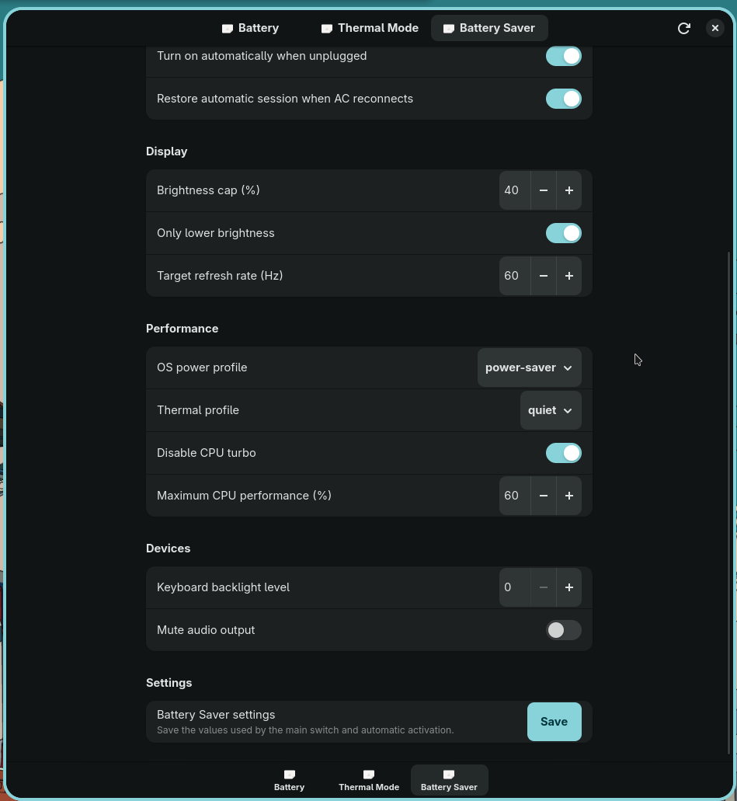

# PowerDeck

<p align="center">
  <strong>Capability-driven Linux power management for Dell laptops.</strong><br>
  Battery charging, verified thermal profiles, and ownership-aware Battery Saver automation.
</p>

<p align="center">
  
  
  
  
</p>



## Experience the interface

The repository includes a standalone interactive product page that simulates the three PowerDeck screens without touching hardware:

- open [`README.html`](README.html) directly; or
- serve the repository locally:

```fish
python -m http.server 8080
```

Then open `http://localhost:8080/README.html`.

The demo is deliberately separate from the real daemon. It changes only values displayed in the browser.

## What works

| Area | Current state |
|---|---|
| Thermal profiles | Verified writes through `platform_profile`; tested on the target laptop |
| Battery charge discovery | Reads bracketed `charge_types`, including the active mode |
| Battery charge writes | Transactional combined-file and legacy split-file backends; real-hardware verification still required |
| Battery Saver | Manual switch plus optional AC edge-triggered automation |
| Restore safety | Restores only settings that still equal PowerDeck's applied value |
| Privilege boundary | GTK app stays unprivileged; system writes go through D-Bus and Polkit |
| Quality gate | Ruff, Mypy, Pytest, and compileall |

## Main features

### Battery

- Reads battery capacity, health, cycle count, AC state, charge mode, and custom thresholds.
- Maps firmware tokens such as `Fast` to PowerDeck's `express` mode.
- Supports both Linux kernel layouts:
  - combined writable `charge_types`, for example `Trickle Fast Standard Adaptive [Custom]`;
  - legacy `charge_types` choices plus a separate writable `charge_type`.
- Uses `snapshot → apply → read back → verify`.
- Restores the exact previous raw firmware token when verification fails.
- Applies custom start/end thresholds transactionally.

### Thermal Mode

- `quiet`
- `cool`
- `balanced`
- `performance`

Profiles are validated against the kernel's advertised choices before a privileged write. The result is read back and verified, with rollback on mismatch.

### Battery Saver

A single runtime switch can turn Battery Saver on or off while connected to AC or running on battery.

Optional automation can:

- activate on the unplug transition;
- lower brightness without raising it;
- select a same-resolution 60 Hz internal-panel mode;
- set the OS power profile;
- set a thermal profile;
- disable turbo and cap Intel P-state performance;
- turn off the keyboard backlight;
- optionally mute the default audio sink;
- restore the previous state on AC reconnect.

Manual changes are respected: PowerDeck restores a setting only when its current value still matches the value PowerDeck applied.

## Architecture

```text
┌──────────────────────────────┐
│ GTK4 / Libadwaita application│
└──────────────┬───────────────┘
               │ system D-Bus
┌──────────────▼───────────────┐
│ powerdeckd (root)            │
│ Polkit authorization         │
│ battery / thermal / CPU I/O  │
└──────────────────────────────┘

┌──────────────────────────────┐
│ powerdeck-agent (user)       │
│ AC edge detection            │
│ Niri / brightness / audio    │
│ restore ownership ledger     │
└──────────────────────────────┘
```

The GUI never runs as root.

## Target platform

The current hardware baseline is:

- Dell Inspiron 15 3530;
- Intel Core i7-1355U with `intel_pstate`;
- CachyOS;
- Niri on Wayland;
- power-profiles-daemon;
- PipeWire/WirePlumber;
- internal 1920×1080 panel with 120 Hz and 60 Hz modes.

PowerDeck is capability-driven, but broader laptop support has not yet been certified.

## System dependencies

PowerDeck uses both Python packages and native Linux services. `pip` does not
install GTK, Libadwaita, Polkit, brightness tools, or power-profiles-daemon.

### Required on Arch/CachyOS

```fish
sudo pacman -S --needed \
    git \
    python \
    python-dbus-next \
    python-gobject \
    gtk4 \
    libadwaita \
    polkit \
    brightnessctl \
    power-profiles-daemon
```

### Optional feature dependencies

| Package/tool | Feature |
|---|---|
| `niri` | Internal-panel refresh-rate switching |
| `wireplumber` / `wpctl` | Optional audio mute and restore |

PowerDeck can still launch without the optional tools. Their related Battery
Saver actions are skipped or reported as unavailable.

## Install the local v0.1 candidate

```fish
git clone https://github.com/minh23102011/fork-dell-power-manager.git
cd fork-dell-power-manager

./scripts/check-dependencies.sh

python -m venv .venv
source .venv/bin/activate.fish

python -m pip install --upgrade pip
python -m pip install -e ".[dev]"

deactivate
./scripts/install-local-v0.1.sh
./scripts/v0.1-check.sh
./powerdeck
```

The installer repeats the required `pacman -S --needed` step so an existing
clone can repair missing native packages. It then configures:

- the `powerdeckd` system service;
- system D-Bus activation;
- the Polkit action;
- the `powerdeck-agent` user service;
- a desktop entry.

To inspect dependencies again:

```fish
./scripts/check-dependencies.sh
```
## Verify before hardware writes

```fish
./scripts/v0.1-check.sh
```

For development:

```fish
source .venv/bin/activate.fish

python -m ruff check .
python -m mypy src
python -m pytest
python -m compileall -q src
```

## Controlled battery verification

Battery charging is firmware-backed. Test it only after the quality gate passes.

1. Read the current state.
2. Apply a non-custom mode.
3. Confirm the bracketed active token changed in `/sys/class/power_supply/BAT0/charge_types`.
4. Restore the original mode.
5. Test custom thresholds last.

Do not interrupt power or reboot during a firmware-backed write. The backend verifies each operation and attempts rollback, but real hardware remains the final integration environment.

## Repository layout

```text
src/powerdeck_core/       Models, validation, errors, transaction rules
src/powerdeck_backends/   Kernel and desktop adapters
src/powerdeck_daemon/     Privileged D-Bus service
src/powerdeck_agent/      Session automation and restore orchestration
src/powerdeck_app/        GTK4 / Libadwaita application
src/powerdeck_cli/        Diagnostics and development commands
data/                     systemd, D-Bus, Polkit, desktop files
tests/                    Unit and fake-hardware tests
README.html               Interactive visual project overview
README.css                Styles for the HTML overview
README.js                 Browser-only demo interactions
```

## Security model

The current local policy permits an active local session to call PowerDeck's validated privileged methods. This is practical for a single-user development laptop, but a general public package should move to an authentication or narrowly scoped policy before release.

## Current limitations

- Dell Inspiron 15 3530 is the only real-hardware validation target.
- Fan curves, direct fan RPM control, undervolting, RAPL tuning, and per-app policies are out of scope for v0.1.
- The HTML demo is a simulation, not a browser control surface.
- Noctalia integration is planned after the standalone app stabilizes.

## License

MIT. See [`LICENSE`](LICENSE).
